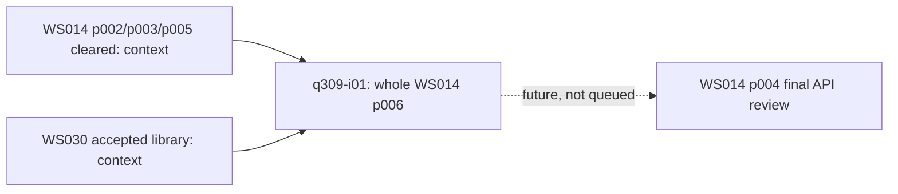

<!-- awesome-plan project=zedbsd record=queue -->

# Queue q309: GPU共有handleと最小Wayland WSI

<!-- awesome-plan-current:start -->
Status: finished
Active Queue: none
Executor: none
Item: q309-i01 cleared (whole ws014-p006)
Previous Queue: q308 finished
<!-- awesome-plan-current:end -->

Authorization: current user、2026-09-13 JST、「では、実行してください。」直前に作成・同期した[p006](https://github.com/awemorris/zedBSD/issues/393)全体への実行指示。Phaseや項目を分割しない。
Finish UTC: 2026-09-12T23:06:52.915013+00:00
Start UTC: 2026-09-12T21:07:48.316198+00:00
Timebox: 720 active minutes estimate; review every120 active minutes. 各build/転送/VM/fixtureをtimeoutで有限化し、同条件無変更retryは最大3回。必要な試験を通過後、理由なく反復しない。
Approved phase snapshot SHA256: `c0ecd29373af480932cee7631ad523d40073fff9a85df02af8d5b1c599a9a8d9`
Baseline commit: `a0032e30d7f71937fc2c6faa911331ba5847dc0c`

| Order | Attempt | Phase | Status | Scope / prerequisites |
| --- | --- | --- | --- | --- |
| 1 | q309-i01 | [ws014-p006](https://github.com/awemorris/zedBSD/issues/393) | cleared | 単一Phase全体。K handle/fd/SCM_RIGHTS→GPU/Venus共有・GPU内WSI→最小Wayland/zwl/wltest→実QEMU受入。p002/p003/p005とWS030の受入出力を使用 |

## 実行範囲と完了条件

[p006](https://github.com/awemorris/zedBSD/issues/393)の全契約を本項目の範囲にする。kernel_handle/handle_fd_*による参照寿命、file/socket/handleのfd統合、SCM_RIGHTS、同一GPUの別process/contextへのallocation共有を実装する。WSIをGPU画像と同期へ対応させ、VK_KHR_wayland_surface、最小client library（libc/include/wayland/、userland/base/libwayland/、/lib/libwayland-client.so）、全画面userland/base/zwl/と標準APIのuserland/base/wltest/を実装する。

新経路の共有・合成・表示にCPU readbackを必須とせず、GPU copy/blitを許容する。実protocol、FIFO/MAILBOX、acquire/release、別processの寿命・終了・再開、画面照合とGPU資源対応を検証する。画像取得用の読み戻しと実表示経路は分ける。既存direct-display/vkdemoの意味を保持し、必要な限定回帰・最終build・適用規約確認を行う。linux-dmabuf-v1、ゲストdma-buf/DRM、EGL、一般DE、native i915、別GPU間共有を追加しない。

## 依存関係

既存のclearanceだけで必要出力を推定せず、現行fd/SCM_RIGHTS/GPU/Venus/libvulkanと実行環境を確認する。p004は後続で未queue、p001の未決定を自動clearしない。WS030はcompletedのまま再利用しない。

## 規約・実行環境・調査上限

[Guardrail](https://github.com/awemorris/zedBSD/issues/363)、plan/coding-style.md全文、独立base実装、対象make -j16と限定試験を適用する。Noct以外の恒久generatorを追加しない。aggregate make check、.internal参照、git add/commit/pushは禁止。追加HAL変更は今回の実行許可に含まず、必要なら具体差分への明示許可を得る。

既存private awe@10.0.10.25のQEMU/Venusとimage/source転送の承認を継続使用する。ホストsystem package変更は範囲に含めない。初期単体fixtureはtimeout120秒、対象build/転送/imageは1200秒、guest受入は180秒を基本とし、変更理由を記録する。失敗はcommand・source/image hash・環境・実測・原因とともに保持し、期待値を緩めて合格扱いしない。

## Upcoming Work Outlook / history

q309後は[WS014 p004](https://github.com/awemorris/zedBSD/issues/385)の最終framework/API整理が候補。その後native i915は別WS029。後続を自動実行しない。

前回q308は全5項目cleared/finished。ローカルplan/history/queue-q308.mdを保持し、[公開済み履歴](https://github.com/awemorris/zedBSD/issues/362#issuecomment-5648315984)を参照する。前回のscope/受入を新しいQueueへ書き換えない。

## q309 checkpoint001: GPU画像共有とWayland実表示（2026-09-13）

ユーザーの指摘に沿って表示経路を確認した。従来のCPU readback経路もGOPへは書かず、virtio-gpuの2D resource/SET_SCANOUTへ送っていた。p006では共有GPU allocationをSET_SCANOUT_BLOBへ渡し、通常のWayland表示にCPU readback/再uploadを必須としない。表示数・接続・推奨サイズはGET_DISPLAY_INFO、追加モード・nominal refreshは今回追加したGET_EDIDのbase/CTA progressive DTDから取得する。無効/未対応EDID時は既存50Hz、100Hz超・standard/established timing・DisplayID・物理vblank保証は対象外。

K handle/fd/SCM_RIGHTS、GPU共有、最小libwayland-client.so、VK_KHR_wayland_surface、zwl、標準Wayland/Vulkanアプリwltestを実装した。K参照・copyout rollback、GPU export/import/scanout、Wayland byte/fd FIFO・queue・frame/release・swapchainの限定試験は通常とASan/UBSanで通過。公開ABIはi386/amd64 C/C++で固定公式Wayland/Vulkan headerに一致、Vulkan137 core＋20 WSIの157 dispatch/exportを照合した。正式CTSや全Wayland SDK互換は主張しない。

実QEMU10.0.11/virglrenderer1.1.0/Intel ANVのq309-wayland-001は21.257秒でPASS。生成元プロセス終了後、独立receiver contextでimportしたGPU画像をGPU copyし、検証専用readbackの1024画素が一致。wltest→実SCM_RIGHTS→別processのzwl→scanoutではFIFO/MAILBOX各6枚、計12枚の320×240実VNC画像が独立oracleと全画素一致した。各modeのswapchain再作成と通常終了、zwl12frame/cleanup_failed=0も確認した。これは初回実測で、最終ソースの受入ではない。

検証後、WSI破棄によるアプリ所有surfaceの暗黙unmapを除き、zwlの明示unmap/remapを整理。共有extentの照会範囲とexport上限を一致させた。クライアント/コンポジタ異常終了・再起動、可視console復帰、最終限定回帰/build/規約確認を継続中。p006とq309-i01はin-progress、q309 active、WS014 incomplete。p004未queue、WS030 completedと既存clearanceを維持。HAL追加変更なし、git add/commit/pushはユーザー担当。

local/uncommitted証拠: plan/ws014/phase006/checkpoint001.json、plan/ws014/temp/remote/q309-wayland-001/result.json とevidence/。source/doc/imageはGitHub repository未公開であり、本同期はIssue/Projectの計画と結果記録。

## q309完了: GPU handle共有・Wayland WSI・virtio scanout（2026-09-13）

WS014 p006 / q309-i01をcleared、q309をfinishedとする。active Queueなし。WS014はincomplete、p001/p004 planning、p004未queue。WS030 completedと既存Phaseのclearanceを維持し、native i915は別WS029のまま。

kernel_handle/handle_fd_*と共通fd参照・SCM_RIGHTS、GPU/Venusの独立process/context共有、VK_KHR_wayland_surface、最小libwayland-client.so、全画面zwl、標準Wayland/Vulkanアプリwltestを実装した。共有GPU imageはGPU copyと所有権同期を経て別processへ渡り、SET_SCANOUT_BLOB/RESOURCE_FLUSHで表示する。通常の新WSI経路にCPU readbackや再uploadを必須としない。旧copy経路もGOPではなくvirtio 2D scanoutであり、直接表示の互換経路として保持する。

GET_DISPLAY_INFOとGET_EDIDのbase/CTA progressive DTDで表示・モードを列挙。実QEMUでは1280×800、74,994mHz、320×200mmを取得した。custom framebuffer寸法はEDID寸法と独立に扱い、1〜100Hzのguest nominal pacingを検証する。virtioは物理pixel clockを設定しないため、物理vblank同期の保証とは区別する。

最終q309-wayland-004は43.869秒、QEMU exit0でPASS。FIFO/MAILBOX各6枚の320×240実VNC画像、計921,600画素が独立期待値と全画素一致し、12回の表示が実import資源とBLOB scanoutに対応した。生成元終了後の独立renderer import/GPU copyも検証専用readbackの1024画素が一致。swapchain再作成、client中断・再open、compositor通常終了・SIGKILL・再起動、実SURFACE_LOST/cleanup=0、強制終了直後の640×480 console復帰とechoによる画面更新を確認した。

同じ最終kernelのq309-direct-002も42.705秒、QEMU exit0でPASS。標準vkdemoの回転直方体6枚をGPU readback/VNC/独立oracleで照合し、通常終了とSIGINT後の再open、console復帰、表示競合拒否とowner完走を確認した。K/fd/SCM・GPU/EDID・Wayland/WSIの実コード限定fixtureとsanitizer、157 Vulkan dispatch/export、両ABIの公式header照合、Noct再生成、rootfs配置、対象buildと全適用規約を確認した。正式CTSや全Wayland SDK互換は主張しない。

途中のharness起動待ち不足とEDID/custom mode回帰を修正し、失敗証拠と再実行理由を保存した。最終reviewのMSG_PEEK二重put疑義は、rights付きpeekを既存guardが拒否するため到達不能と確認し、本体変更を戻して拒否後の参照寿命を追加検証した。formatterは規約と設定の不一致によりexit1でありPASSとは扱わず、全文確認とdiffcheckを記録した。HAL追加変更なし。ローカル結果はplan/ws014/phase006/results.md、技術資料3件、conformance.mdとfinal-evidence/verification.json、Queue履歴はplan/history/queue-q309.md。これらsource/doc/imageのgit add/commit/pushはユーザーが行う。本同期はGitHub Issues/Projectの計画・受入結果である。
