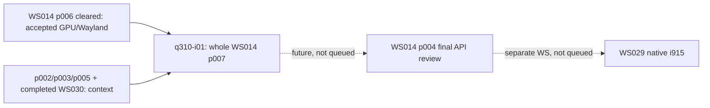

<!-- awesome-plan project=zedbsd record=queue -->

# Queue q310: GPUレビュー対応とBLOB直接表示

<!-- awesome-plan-current:start -->
Status: finished
Active Queue: none
Last Queue: q310 finished
Executor: none
Item: q310-i01 cleared (whole ws014-p007)
Previous Queue: q309 finished
<!-- awesome-plan-current:end -->

Authorization: current user、2026-09-13 JST。i915前に実装改善Phaseを作り実行する指示。続く回答でGPU実装・描画経路・同期・性能に限定し、zwl/libwaylandのテストドライバ制約は現状で問題ないと明示。
Start UTC: 2026-09-13T00:04:16.013604+00:00
Timebox: 720 active minutes estimate; review every120 active minutes. fixture120秒、build/転送1200秒、VM180秒を基本に有限化。同条件無変更retryは3回まで、試験は必要な変更影響に限定。
Original approved phase snapshot SHA256: `84d2bb080ed72041858541c020a2d6ff5e510cf30652e62178207c278945f335`
Baseline commit: `ea32e2367589ad1349f3ae08a6265586d28d6a1d`

| Order | Attempt | Phase | Status | Scope / prerequisites |
| --- | --- | --- | --- | --- |
| 1 | q310-i01 | [ws014-p007](https://github.com/awemorris/zedBSD/issues/394) | cleared | p007全体。p006/既存GPUと標準Vulkan出力を使い、通知・batch/map・BLOB direct/async present・共有・並行性・回復と実QEMU受入を一つの項目で行う |

## 実行範囲・受入

p007のP1–P11処置表と全完了条件を本項目の範囲にする。一般Wayland環境化P9/P10はユーザー判断で対象外。実装の正しさ・有限性・所有権を維持し、正常表示のCPU画像往復を除く。通常描画と診断readback、送信受理とGPU/表示完了を区別して検証する。P7の別GPU共有/WC cache変更は追加しない。

## 依存関係

[Guardrail](https://github.com/awemorris/zedBSD/issues/363)、plan/coding-style.md全文とmake -j16を適用。Noct以外の恒久generator、aggregate make check、.internal、git add/commit/pushは禁止。追加HALは今回の承認に含めない。既存private awe@10.0.10.25環境/転送を使用し、system package変更、VFIO操作、GDM停止やhost rebootはしない。

## Upcoming Work Outlook / history

q310後の候補は[p004](https://github.com/awemorris/zedBSD/issues/385)の最終API・規約レビュー。その後のnative i915は[WS029](https://github.com/awemorris/zedBSD/issues/386)。後続を自動実行しない。

q309の正確な実行scope/結果はlocal plan/history/queue-q309.mdと[公開履歴](https://github.com/awemorris/zedBSD/issues/362#issuecomment-5649301145)へ保存済み。既存clearanceや失敗履歴を新Queueで書き換えない。

## q310追補: 標準external memory/fence fdと描画・表示の組（2026-09-13）

ユーザーの追加review2 B/C/E/F/Gを[WS014 p007](https://github.com/awemorris/zedBSD/issues/394)へ追加し、q310-i01の同じ目標で実行する。KERNEL_HANDLE_FENCE/POLLIN・command/present wait/signal、VK_KHR_external_fence_fdとVK_KHR_external_memory_fdのOPAQUE_FD、必要な標準問い合わせ/拡張依存、libvulkanでの描画nodeと表示nodeの組、driverによるscanout import可否/制約照会、swapchain作成時の一度だけの共有またはCPU fallback判断を含める。

OPAQUE_FDはLinux dma-buf/SYNC_FDを要求しないが、同じdeviceUUID/driverUUIDの互換条件を守る。別描画GPUからの無条件importは前提にしない。表示専用foreign importはdriverが実backingを検証した場合のみで、未対応は拒否する。通常VenusのBLOB直接表示を受入条件として維持する。別node/制約/fallbackは実コードfixture、標準共有・描画・寿命は実Venusで検証する。

zwlの同期1surface/passとlibwayland限定protocolはユーザー承認のテストドライバ範囲として維持。一般Wayland/Toolkit、external_semaphore_fdやdisplay_controlの全API、native i915、新HAL/物理foreign-DMA受入、git add/commit/pushは自動追加しない。720 active minutes見積/120分レビューを維持。新規機能の実装・受入成功はまだ記録していない。p004はこの追加を含む最終APIを後続で確認し、未queueのまま。

## q310 checkpoint 01: 実QEMUで並行操作・標準fd共有を確認（2026-09-13）

[WS014 p007](https://github.com/awemorris/zedBSD/issues/394) / q310-i01 は実装・検証を継続中。p007は未完了であり、p004/native i915には進んでいない。

- 実QEMU `q310-wayland-005` で同一GPU fdの4 pthread×32回（128 allocation lifecycle）の書込/読出全4096 byte照合がPASS。
- 別processの標準Vulkan OPAQUE_FD fenceのexport/import/reset・実GPU signal・参照寿命がPASS。linear共有と標準buffer OPAQUE_FDのproducer終了後import/GPU copy/pixel検証もPASS。
- 同じ実行はoptimal image capability queryでVK_ERROR_FORMAT_NOT_SUPPORTEDとなりFAIL。対応が必要なnative dedicated allocation条件を確認し、必要なVK_KHR_get_memory_requirements2 / VK_KHR_dedicated_allocationを標準APIで補う。対応型の能力を偽って成功扱いにしない。Vulkan coreは1.0を維持する。
- 限定fixtureの通常版/ASan・UBSanではtyped fence/poll/SCM_RIGHTS、signal fd close/reuse競合、K allocation rollback・元所有者終了後の保持、display-only foreign backingのDMA/cache拒否と最後の解放、非同期presentの所有権、作成時に一度だけのfallback選択、command batching、mapped reply、IRQ out-of-order/制御用slot確保を確認した。fixtureと実GPUの証拠は区別する。
- 実試験で見つかったQUERY出力欄をRESET/WAIT入力へ再利用する不具合を修正。次に露呈したAMD64 pthread初期SPのC ABI不一致はlibcで修正し、005で例外が消えた。HAL変更は行っていない。
- 失敗履歴001（旧診断不足）、002（harnessで未対応の`;`を入力）、003（RESET EINVAL）、004（workerのmovapsでstack alignment例外）、005（上記optimal profile拒否）を保存。失敗を過去の成功へ書き換えない。

残件はoptimal allocationの標準API受入、direct BLOB/Waylandの画面・寿命・性能検証、故障/回復の有限試験、最終API/規約/宣言再生成確認。zwlとlibwaylandの承認済みテストドライバ制約は維持する。資料・コードは作業treeにありgit add/commit/pushはユーザー担当。GitHub Issues/Projectの同期とrepository公開を混同しない。

ローカル証拠: `plan/ws014/temp/remote/q310-wayland-001`〜`005`（実行ごとのsource/image hash、build/transfer/guest/renderer log）。UAPI対応表は `plan/ws014/phase007/gpu-uapi-contract.md`。同表は下記Phase本文にも掲載する。720 active minutes見積・120分レビューを維持し、今回のcheckpoint後もq310を継続する。

q310 checkpoint 02: paired OPAQUE rendererでstandard buffer/optimal/fence、Wayland12画面、direct6画面と通常readback0、producer終了error、10000ms timeout後のchecked recoveryを実QEMUでPASS。最後のtopology POLLPRI/ACK通知と統合確認を継続中。詳細は[WS014 p007](https://github.com/awemorris/zedBSD/issues/394)。

## q310完了: BLOB直接表示・標準fd共有・GPU同期改善（2026-09-13）

WS014 p007 / q310-i01をcleared、q310をfinishedとする。active Queueなし。WS014はincompleteでp001/p004はplanning、p004とWS029 native i915は未queue。p006/q309・WS030の既存clearanceを維持する。

直接VK_KHR_displayもGPU copy/blit→共有linear画像→SET_SCANOUT_BLOBへ移行し、通常vkdemoのCPU画像readback/uploadを除いた。IRQ完了通知、vkCmd batchingとmapped reply、表示待ち中のcontroller排他短縮、所有jobによる非同期present、同一openの待機admission、安全なtransport回復を実装した。

review2 B/C/E/F/Gも反映: KERNEL_HANDLE_FENCE/POLLINとcommand/present wait/signal、標準VK_KHR_external_memory_fdとexternal_fence_fdのOPAQUE_FD、描画node＋表示nodeの組、driverによるscanout import判定とswapchain作成時に一度だけの経路選択。GPU_DISPLAY_EVENTS/POLLPRIのQUERY→列挙→exact ACKと、GPU_BLOB_CREATE_PLACEDによる物理配置要求を追加した。GPU ABI v1の旧要求layoutを保ち、内部drv_gpu_opsはv6。実backingで満たせない配置はENOTSUP、OOMやdevice lossはfallbackで隠さない。

OPAQUE_FDはguestにdma-buf/SYNC_FDを要求しない。標準memory共有は同じdeviceUUID/driverUUIDの互換範囲、別GPUの任意importは未対応。表示専用foreign import・DMA/cache/placement・別node組合せは実コードfixtureによる検証であり、異種実機DMAや新HAL allocatorの受入ではない。Venusは非零physical placementを拒否する。

| 最終実QEMU | 結果 |
| --- | --- |
| q310-wayland-008 | PASS、46.531秒、QEMU exit0。128回同一fd並行操作、標準fence・linear/buffer/optimal共有、初期topology QUERY/ACK、FIFO/MAILBOX各6画面・異常終了/reopen/console |
| q310-direct-004 | PASS、41.83秒、QEMU exit0。直接表示6画面の独立oracle、通常readback0の動く2実画像、QEMU BLOB trace/対象寸法のlegacy経路なし、SIGINT/reopen/lease競合/console |
| q310-fence-exit-003 | PASS、4.424秒、QEMU exit0。pending producer終了後DEVICE_LOST、独立30秒fault期限と実測、最終waitpid |
| q310-recovery-004 | PASS、13.807秒、QEMU exit0。所有rendererだけを停止、10000ms timeoutとpeer error/旧参照gate、再開後checked resetと新contextの4096byte/decoder |

最終buildと限定K/U/driver/WSI fixtureの通常・ASan/UBSan、170公開APIのdispatch/両ABI、Noct生成8file一致を確認した。通常デモは約2秒で13frame程度という実測を残し、速度倍率や物理vblank保証・CTS適合を主張しない。zwlの同期1surface/passとlibwayland限定protocolはユーザー承認のテストドライバ制約として維持する。

optimal共有はstock virglrenderer1.1.0 proxyのOPAQUE attach不足を補ったisolated paired library/serverで受入した。exact168B capsetとINIT handshakeで合意した場合だけ選択し、private WSIのnative DMA経路を保持。system library/packageは変更していない。patch/library/server hashと手順はlocal/uncommitted plan/ws014/phase007/renderer-opaque/に保存した。stockだけでoptimal共有が通るとは扱わない。

失敗履歴wayland001–005、direct001、recovery001、fence-exit002を保存。fence-exit002はconsumer/driver双方10秒の期限競合でVK_TIMEOUTが先行した。fault専用期限を30秒に分け、final closeはpending fenceをerrorへしてからcallback drainを待つ順序へ改善した。修正前FAIL・修正後normal/sanitizer PASSの因果fixtureも保存し、実行中ioctl/file参照によるfinal close入口までの遅延とは区別する。

資料はlocal/uncommitted plan/ws014/phase007/results.md、gpu-uapi-contract.md、display-wsi.md、transport-sync.md、各verification JSONとQueue履歴plan/history/queue-q310.md。新HAL変更・GDM/VFIO操作・git add/commit/pushなし。GitHub Issues/Projectへの計画/受入同期と、ユーザー担当のrepository公開を区別する。
